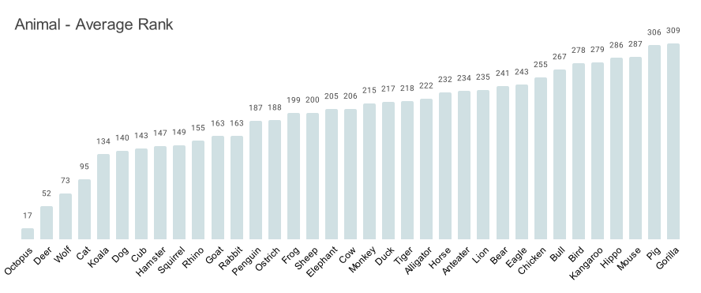
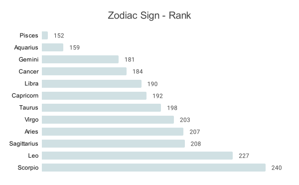

# ACNH Villager Popularity: SQL Analysis

## Table of Contents

 - [Goal 1A: Are there more male or female villagers?](Analysis.md#goal-1a-are-there-more-male-or-female-villagers)
 - [Goal 1B: Which villager gender is more popular?](Analysis.md#goals-1b-which-villager-gender-is-more-popular)
 - [Goal 2A: How many villagers are there for each personality?](nalysis.md#goal-2a-how-many-villagers-are-there-for-each-personality)
 - [Goal 2B: Which personality type is the most/least popular?](Analysis.md#goal-2b-which-personality-type-is-the-mostleast-popular)
 - [Goal 3A: How many villagers are there per animal type?](Analysis.md#goal-3a-how-many-villagers-are-there-per-animal-type)
 - [Goal 3B: What is the most/least popular animal type?](Analysis.md#goal-3b-what-is-the-mostleast-popular-animal-type)
 - [Goal 4A: What is the most/least common zodiac sign of the villagers?](Analysis.md#goal-4a-what-is-the-mostleast-common-zodiac-sign-of-the-villagers)
 - [Goal 4B: Which zodiac sign is the most/least popular?](Analysis.md#goal-4b-which-zodiac-sign-is-the-mostleast-popular)
 - [Goal 5A: *What is the most/least popular villager* by gender, personality, animal, and zodiac sign?](Analysis.md#goal-5a-what-is-the-mostleast-popular-villager-by-gender-personality-animal-and-zodiac-sign)
 - [Goal 5B: *What is the most/least popular combination* of gender, personality, animal, and zodiac sign?](Analysis.md#goal-5b-what-is-the-mostleast-popular-combination-of-gender-personality-animal-and-zodiac-sign)
 - [Conclusion](Analysis.md#conclusion)

## Goal 1A: Are there more male or female villagers?

```
-- Are there more male or female villagers?  
SELECT gender, COUNT(i.villager_name) AS villager_count,  
FROM  `ACNH_Villager_Project.VillagerInfo`  AS i  
JOIN  `ACNH_Villager_Project.VillagerPopularity`  AS p  
ON i.villager_name = p.name  
GROUP  BY gender  
ORDER  BY  COUNT(i.villager_name) DESC;
```


There are more *male* villagers than female villagers.

## Goal 1B: Which villager gender is more popular?
```
SELECT gender, ROUND(AVG(total_rank), 0) as avg_rank  
FROM  `ACNH_Villager_Project.VillagerInfo`  AS i  
JOIN  `ACNH_Villager_Project.VillagerPopularity`  AS p  
ON i.villager_name = p.name  
GROUP  BY gender  
ORDER  BY avg_rank DESC;
```
  
*Female* villagers are more popular than male villagers. A lower rank number (like 1) means the category is more popular!

## Goal 2A: How many villagers are there for each personality?
```
SELECT gender, personality, COUNT (personality) AS personality_count  
FROM  `ACNH_Villager_Project.VillagerInfo`  AS i  
JOIN  `ACNH_Villager_Project.VillagerPopularity`  AS p  
ON i.villager_name = p.name  
GROUP  BY gender, personality  
ORDER  BY gender ASC, personality ASC;
```
  
The most common personality types:

 - 59 out of the 187 female villagers are *Normal* 
 - 60 out of the 207 male villagers are *Lazy*

The rarest personality types:

 - Only 24 out of the 187 female villagers are *Big Sister*
 - Only 34 out of the 207 male villagers are *Smug*

## Goal 2B: Which personality type is the most/least popular?
```
SELECT gender, personality, ROUND(AVG(total_rank), 2) as avg_rank  
FROM  `ACNH_Villager_Project.VillagerInfo`  AS i  
JOIN  `ACNH_Villager_Project.VillagerPopularity`  AS p  
ON i.villager_name = p.name  
GROUP  BY gender, personality  
ORDER  BY gender ASC, personality ASC;
```
  
The most popular personality types are: 
 1. *Big Sister* - female with an average rank of 151.08
 2. *Normal* - female with an average rank of 151.42
 3. *Peppy* - female with an average rank of 157.1

The least popular personality types are:

 1. *Snooty* - female with an average rank of 244.56
 2. *Cranky* - male with an average rank of 237.89
 3. *Jock* - male with an average rank of 223.38

## Goal 3A: How many villagers are there per animal type?
```
SELECT animal, COUNT (animal) AS animal_count  
FROM  `ACNH_Villager_Project.VillagerInfo`  AS i  
JOIN  `ACNH_Villager_Project.VillagerPopularity`  AS p  
ON i.villager_name = p.name  
GROUP  BY animal  
ORDER  BY animal ASC;
```


The most common animals are: 
 1. *Cats* - 23 villagers
 2. *Rabbit* - 20 villagers
 3. *Frog* & *Squirrel* - tied, with 18 villagers each

The rarest animals are:

 1. *Octopus* - 3 villagers
 2. *Cow* - 4 villagers
 3. *Rhino* & *Bull* - tied, with 6 villagers each

## Goal 3B: What is the most/least popular animal type?
```
SELECT animal, ROUND(AVG(total_rank), 2) as avg_rank  
FROM  `ACNH_Villager_Project.VillagerInfo`  AS i  
JOIN  `ACNH_Villager_Project.VillagerPopularity`  AS p  
ON i.villager_name = p.name  
GROUP  BY animal  
ORDER  BY avg_rank ASC;  
```
  
The most popular animals are: 
 1. *Octopus*
 2. *Deer*
 3. *Wolf*

The least popular animals are:

 1. *Gorilla*
 2. *Pig*
 3. *Mouse*

## Goal 4A: What is the most/least common zodiac sign of the villagers?
```
SELECT zodiac_sign, COUNT (zodiac_sign) AS zodiac_count  
FROM  `ACNH_Villager_Project.VillagerInfo`  AS i  
JOIN  `ACNH_Villager_Project.VillagerPopularity`  AS p  
ON i.villager_name = p.name  
GROUP  BY zodiac_sign  
ORDER  BY zodiac_sign ASC;
``` 


The most common Zodiac signs are: 
 1. *Leo* - 38 villagers
 2. *Libra* - 35 villagers
 3. *Virgo* - 34 villagers

The least common Zodiac signs are:

 1. *Pisces* - 28 villagers
 2. *Aries*, *Capricorn*, & *Taurus* - 31 villagers each
 3. *Cancer* & *Scorpio* - 32 villagers each

## Goal 4B: Which zodiac sign is the most/least popular?
```
SELECT zodiac_sign, ROUND(AVG(total_rank), 2) as avg_rank  
FROM  `ACNH_Villager_Project.VillagerInfo`  AS i  
JOIN  `ACNH_Villager_Project.VillagerPopularity`  AS p  
ON i.villager_name = p.name  
GROUP  BY zodiac_sign  
ORDER  BY avg_rank ASC;
```
  

The most popular Zodiac signs are: 
 1. *Pisces* - average rank of 152
 2. *Aquarius* - average rank of 159
 3. *Gemini* - average rank of 181

The least popular Zodiac signs are:

 1. *Scorpio* - average rank of 240
 2. *Leo* - average rank of 227
 3. *Sagittarius* - average rank of 208

## Goal 5A: What is the most/least popular villager by gender, personality, animal, and zodiac sign?
```
-- Google Sheets Formula format used to pull highest and lowest avg_rank from other sheets
=INDEX('1B: Gender Rank'!$A$2:$A,MATCH(MIN('1B: Gender Rank'!$B$2:$B),'1B: Gender Rank'!$B$2:$B,0))
```

| Villager Attribute | Most Popular | Least Popular |
|--------------------|--------------|---------------|
| Gender             | Female       | Male          |
| Personality        | Big Sister   | Snooty        |
| Animal             | Octopus      | Gorilla       |
| Zodiac Sign        | Pisces       | Scorpio       |  

We now know the most/least popular villager for each of our 4 attributes!  
Just for fun, let's see if we can narrow down the most/least popular combination

## Goal 5B: What is the most/least popular combination of gender, personality, animal, and zodiac sign?

```
-- Grouping the data as needed

SELECT  ROUND(AVG(total_rank), 2) as avg_rank, personality, animal, zodiac_sign  
FROM  `ACNH_Villager_Project.VillagerInfo`  AS i  
JOIN  `ACNH_Villager_Project.VillagerPopularity`  AS p  
ON i.villager_name = p.name  
GROUP  BY personality, animal, zodiac_sign  
ORDER  BY avg_rank ASC;

-- Now to find the highest and lowest avg_rank records
```
```
WITH ranked_data AS (  
SELECT  
ROUND(AVG(total_rank), 2) AS avg_rank,  
personality,  
animal,  
zodiac_sign,  
ROW_NUMBER() OVER (ORDER  BY  AVG(total_rank) ASC) AS rank_asc,  
ROW_NUMBER() OVER (ORDER  BY  AVG(total_rank) DESC) AS rank_desc  
FROM  `ACNH_Villager_Project.VillagerInfo`  AS i  
JOIN  `ACNH_Villager_Project.VillagerPopularity`  AS p  
ON i.villager_name = p.name  
GROUP  BY personality, animal, zodiac_sign  
)  
SELECT avg_rank, personality, animal, zodiac_sign  
FROM ranked_data  
WHERE rank_asc = 1  OR rank_desc = 1;
```
| popularity rank | personality | animal | zodiac_sign |
|-----------------|-------------|--------|-------------|
| 391             | Snooty      | Goat   | Capricorn   |
| 1               | Smug        | Cat    | Libra       |

The **most popular** combination is a Male, Smug, Cat, Libra!  
The **least popular** combination is a Female, Snooty, Goat, Capricorn!
  
While this seems interesting, it doesn't tell us much more than our overall ranking. There are 391 combinations, which is only a few less than our total # of villager count. 

## Conclusion

From our analysis, we can determine certain attributes give a villager a higher chance of being popular within the ACNH community.
  
-   *Female* villagers are overall more likely to be popular. This rings true in our personality analysis, where we see *Big Sister*, *Normal*, and *Peppy* villagers are more likely to be popular. Female *Snooty* villagers, and male *Cranky* & *Jock* villagers are least likely to be popular.
  
-   The most popular animal is an *Octopus*, which is also the rarest animal. However, we cannot determine any further correlation between our top 3 most/least popoular animals and their rarity. *Deer* and *Wolf* animals are also likely to be popular, while *Gorilla*, *Pig*, and *Mouse* villagers are least likely to be popular.
  
-   *Leo* is the most common Zodiac sign, and *Pisces* is the least common sign. Interestingly, *Pisces* is also the most popular sign, with *Aquarius* at a close second. Additionally *Scorpio* and *Leo* are the least popular signs. This shows us there is some correlation between a Zodiac signs rarity and popularity.

Going forward, I hope to further analyze this dataset to see what other attributes may contribute to a villager's popularity.
