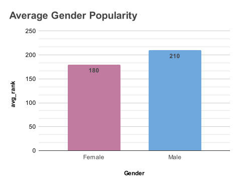
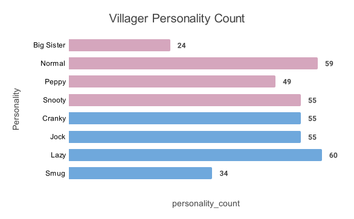
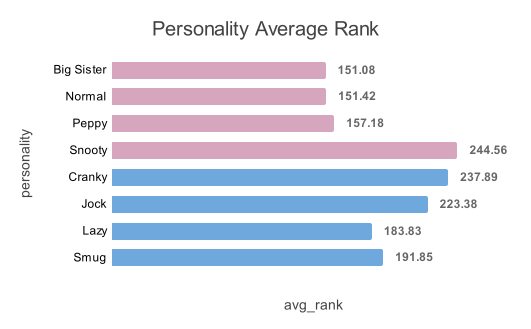
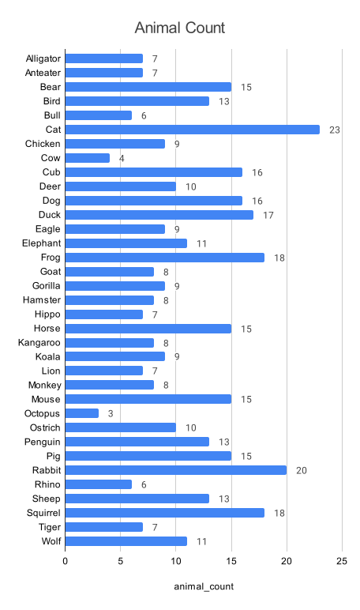

# ACNH Villager Popularity: SQL Analysis

## Table of Contents

 - [Goal 1A: Are there more male or female villagers?](Analysis.md#goal-1a-are-there-more-male-or-female-villagers)
 - [Goal 1B: Which villager gender is more popular?](Analysis.md#goals-1b-which-villager-gender-is-more-popular)
 - [Goal 2A: How many villagers are there for each personality?](nalysis.md#goal-2a-how-many-villagers-are-there-for-each-personality)
 - [Goal 2B: Which personality type is the most/least popular?](Analysis.md#goal-2b-which-personality-type-is-the-mostleast-popular)
 - [Goal 3A: How many villagers are there per animal type?](Analysis.md#goal-3a-how-many-villagers-are-there-per-animal-type)
 - [Goal 3B: What is the most/least popular animal type?](Analysis.md#goal-3b-what-is-the-mostleast-popular-animal-type)
 - [Goal 4A: What is the most/least common zodiac sign of the villagers?](Analysis.md#goal-4a-what-is-the-mostleast-common-zodiac-sign-of-the-villagers)
 - [Goal 4B: Which zodiac sign is most/least likely to be popular?](Analysis.md#goal-4b-which-zodiac-sign-is-mostleast-likely-to-be-popular)
 - [Goal 5A: *What is the most/least popular villager* by gender, personality, animal, and zodiac sign?](Analysis.md#goal-5a-what-is-the-mostleast-popular-villager-by-gender-personality-animal-and-zodiac-sign)
 - [Goal 5B: *What is the most/least popular combination* of gender, personality, animal, and zodiac sign?](Analysis.md#goal-5b-what-is-the-mostleast-popular-combination-of-gender-personality-animal-and-zodiac-sign)

## Goal 1A: Are there more male or female villagers?

```
-- Are there more male or female villagers?  
SELECT gender, COUNT(i.villager_name) AS villager_count,  
FROM  `ACNH_Villager_Project.VillagerInfo`  AS i  
JOIN  `ACNH_Villager_Project.VillagerPopularity`  AS p  
ON i.villager_name = p.name  
GROUP  BY gender  
ORDER  BY  COUNT(i.villager_name) DESC;
```


## Goal 1B: Which villager gender is more popular?
```
SELECT gender, ROUND(AVG(total_rank), 0) as avg_rank  
FROM  `ACNH_Villager_Project.VillagerInfo`  AS i  
JOIN  `ACNH_Villager_Project.VillagerPopularity`  AS p  
ON i.villager_name = p.name  
GROUP  BY gender  
ORDER  BY avg_rank DESC;
```


## Goal 2A: How many villagers are there for each personality?
```
SELECT gender, personality, COUNT (personality) AS personality_count  
FROM  `ACNH_Villager_Project.VillagerInfo`  AS i  
JOIN  `ACNH_Villager_Project.VillagerPopularity`  AS p  
ON i.villager_name = p.name  
GROUP  BY gender, personality  
ORDER  BY gender ASC, personality ASC;
```


## Goal 2B: Which personality type is the most/least popular?
```
SELECT gender, personality, ROUND(AVG(total_rank), 2) as avg_rank  
FROM  `ACNH_Villager_Project.VillagerInfo`  AS i  
JOIN  `ACNH_Villager_Project.VillagerPopularity`  AS p  
ON i.villager_name = p.name  
GROUP  BY gender, personality  
ORDER  BY gender ASC, personality ASC;
```


## Goal 3A: How many villagers are there per animal type?
```
SELECT animal, COUNT (animal) AS animal_count  
FROM  `ACNH_Villager_Project.VillagerInfo`  AS i  
JOIN  `ACNH_Villager_Project.VillagerPopularity`  AS p  
ON i.villager_name = p.name  
GROUP  BY animal  
ORDER  BY animal ASC;
```


## Goal 3B: What is the most/least popular animal type?
```
SELECT animal, ROUND(AVG(total_rank), 2) as avg_rank  
FROM  `ACNH_Villager_Project.VillagerInfo`  AS i  
JOIN  `ACNH_Villager_Project.VillagerPopularity`  AS p  
ON i.villager_name = p.name  
GROUP  BY animal  
ORDER  BY avg_rank ASC;
```
## Goal 4A: What is the most/least common zodiac sign of the villagers?
```
SELECT zodiac_sign, COUNT (zodiac_sign) AS zodiac_count  
FROM  `ACNH_Villager_Project.VillagerInfo`  AS i  
JOIN  `ACNH_Villager_Project.VillagerPopularity`  AS p  
ON i.villager_name = p.name  
GROUP  BY zodiac_sign  
ORDER  BY zodiac_sign ASC;
```
## Goal 4B: Which zodiac sign is most/least likely to be popular?
```
SELECT zodiac_sign, ROUND(AVG(total_rank), 2) as avg_rank  
FROM  `ACNH_Villager_Project.VillagerInfo`  AS i  
JOIN  `ACNH_Villager_Project.VillagerPopularity`  AS p  
ON i.villager_name = p.name  
GROUP  BY zodiac_sign  
ORDER  BY avg_rank ASC;
```
## Goal 5A: What is the most/least popular villager by gender, personality, animal, and zodiac sign?
```
-- Google Sheets Formula format used to pull highest and lowest avg_rank from other sheets
=INDEX('1B: Gender Rank'!$A$2:$A,MATCH(MIN('1B: Gender Rank'!$B$2:$B),'1B: Gender Rank'!$B$2:$B,0))
```
## Goal 5B: What is the most/least popular combination of gender, personality, animal, and zodiac sign?
```
-- Grouping the data as needed

SELECT  ROUND(AVG(total_rank), 2) as avg_rank, personality, animal, zodiac_sign  
FROM  `ACNH_Villager_Project.VillagerInfo`  AS i  
JOIN  `ACNH_Villager_Project.VillagerPopularity`  AS p  
ON i.villager_name = p.name  
GROUP  BY personality, animal, zodiac_sign  
ORDER  BY avg_rank ASC;

-- Now to find the highest and lowest avg_rank records
```
```
WITH ranked_data AS (  
SELECT  
ROUND(AVG(total_rank), 2) AS avg_rank,  
personality,  
animal,  
zodiac_sign,  
ROW_NUMBER() OVER (ORDER  BY  AVG(total_rank) ASC) AS rank_asc,  
ROW_NUMBER() OVER (ORDER  BY  AVG(total_rank) DESC) AS rank_desc  
FROM  `ACNH_Villager_Project.VillagerInfo`  AS i  
JOIN  `ACNH_Villager_Project.VillagerPopularity`  AS p  
ON i.villager_name = p.name  
GROUP  BY personality, animal, zodiac_sign  
)  
SELECT avg_rank, personality, animal, zodiac_sign  
FROM ranked_data  
WHERE rank_asc = 1  OR rank_desc = 1;
```
img

The **most popular** combination is a Male, Smug, Cat, Libra!
The **least popular** combination is a Female, Snooty, Goat, Capricorn!
